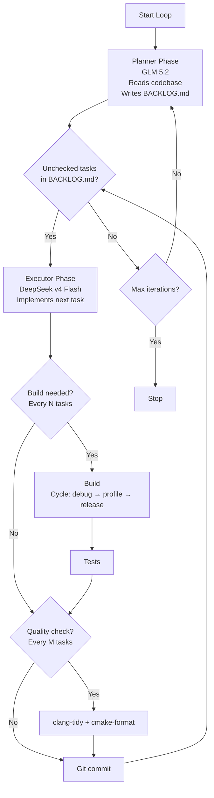

# Agentic Loop — Planner / Executor Architecture

An autonomous coding loop built on [OpenCode](https://opencode.ai) that
alternates between a **planner** (expensive, powerful model) and an
**executor** (cheap, fast model) to continuously improve the
Kataglyphis-BeschleunigerBallett graphics engine.

## Architecture



### Key Design Principles

1. **Queue discipline**: The executor must drain ALL unchecked tasks in
   `BACKLOG.md` before the planner adds new ones. This prevents task
   accumulation and ensures each task gets full attention.

2. **Model tiering**: The planner uses an expensive, powerful model (GLM 5.2)
   for high-quality analysis and task descriptions. The executor uses a
   cheaper, faster model (DeepSeek v4 Flash) for implementation — it relies
   on the planner's detailed task descriptions to work efficiently.

3. **Build cycling**: After every N completed tasks, a build is triggered.
   The build configuration cycles through `clangcl-debug`,
   `clangcl-profile`, and `clangcl-release` (Windows) or the Linux
   equivalents — so the loop doesn't only test debug builds.

4. **Periodic quality gates**: clang-tidy and cmake-format run every M
   tasks to catch drift early.

5. **Periodic refactor focus**: Every R iterations, the planner focuses
   exclusively on refactoring tasks (dead code, API consolidation, test
   gaps, documentation drift, C++23 modernization).

## Files

| File | Purpose |
| --- | --- |
| `opencode.json` | OpenCode project config: agent definitions, model bindings, commands |
| `.opencode/agents/planner.md` | Planner agent system prompt (GLM 5.2) |
| `.opencode/agents/executor.md` | Executor agent system prompt (DeepSeek v4 Flash) |
| `.opencode/commands/plan.md` | `/plan` slash command |
| `.opencode/commands/execute.md` | `/execute` slash command |
| `.opencode/commands/build.md` | `/build` slash command |
| `.opencode/commands/test.md` | `/test` slash command |
| `.opencode/commands/quality.md` | `/quality` slash command |
| `Scripts/AgenticLoop/AgenticLoop.config.json` | Loop configuration (models, intervals, build configs) |
| `Scripts/AgenticLoop/Run-AgenticLoop.ps1` | Windows orchestration script (PowerShell) |
| `Scripts/AgenticLoop/Run-AgenticLoop.sh` | Linux orchestration script (Bash) |

## Prerequisites

### OpenCode

Install OpenCode:

```pwsh
# Windows
scoop install opencode
# or
npm install -g opencode-ai
```

```bash
# Linux
curl -fsSL https://opencode.ai/install | bash
```

Authenticate with your model providers:

```bash
opencode auth login
```

### Container Runtime

- **Windows**: [Stevedore](https://github.com/kataglyphis/Kataglyphis-ContainerHub)
  (Docker) — already configured via `Build-Windows-Container.ps1`.
- **Linux**: [Rancher Desktop](https://rancherdesktop.io/) — provides the
  Docker-compatible CLI for any containerized build steps.

### jq (Linux only)

The Linux script uses `jq` to parse the config:

```bash
sudo apt install jq   # Debian/Ubuntu
```

## Configuration

Edit `Scripts/AgenticLoop/AgenticLoop.config.json`:

```json
{
  "models": {
    "planner": "zai/glm-5.2",
    "executor": "deepseek/deepseek-chat"
  },
  "intervals": {
    "buildEveryNTasks": 3,
    "qualityEveryNTasks": 5,
    "refactorEveryNIterations": 3,
    "testAfterBuild": true,
    "maxExecutorRetries": 3,
    "loopDelaySeconds": 10,
    "maxIterations": 0
  },
  "buildConfigurations": {
    "windows": ["clangcl-debug", "clangcl-profile", "clangcl-release"],
    "linux": ["linux-debug-clang", "linux-debug-tsan-clang", "linux-release-clang"]
  }
}
```

### Model IDs

The model IDs use the OpenCode `provider/model-id` format. Adjust them to
match your configured providers. Run `opencode models` to see what is
available. Common options:

| Role | Model ID | Notes |
| --- | --- | --- |
| Planner | `opencode-go/glm-5.2` | GLM 5.2 — powerful, expensive |
| Executor | `opencode-go/deepseek-v4-flash` | DeepSeek v4 Flash — cheap, fast |

You can also use environment variables to override at runtime:

```pwsh
$env:OPENCODE_PLANNER_MODEL = "zai/glm-5.2"
$env:OPENCODE_EXECUTOR_MODEL = "deepseek/deepseek-chat"
```

## Usage

### Full loop (Windows)

```pwsh
pwsh -ExecutionPolicy Bypass -File .\Scripts\AgenticLoop\Run-AgenticLoop.ps1
```

### Full loop (Linux)

```bash
./Scripts/AgenticLoop/Run-AgenticLoop.sh
```

### Dry run (see what would happen)

```pwsh
pwsh -ExecutionPolicy Bypass -File .\Scripts\AgenticLoop\Run-AgenticLoop.ps1 -DryRun
```

### Planner only (add tasks without executing)

```pwsh
pwsh -ExecutionPolicy Bypass -File .\Scripts\AgenticLoop\Run-AgenticLoop.ps1 -PlannerOnly
```

### Executor only (drain current queue)

```pwsh
pwsh -ExecutionPolicy Bypass -File .\Scripts\AgenticLoop\Run-AgenticLoop.ps1 -ExecutorOnly
```

### Limited iterations

```pwsh
pwsh -ExecutionPolicy Bypass -File .\Scripts\AgenticLoop\Run-AgenticLoop.ps1 -MaxIterations 5
```

### Skip builds/tests/quality (fast planning cycle)

```pwsh
pwsh -ExecutionPolicy Bypass -File .\Scripts\AgenticLoop\Run-AgenticLoop.ps1 -SkipBuild -SkipTests -SkipQuality
```

### Interactive OpenCode commands

You can also use the slash commands directly in the OpenCode TUI:

```
/plan          — run the planner
/execute       — execute the next task
/build debug   — build with a specific preset
/test          — run tests
/quality       — run clang-tidy + cmake-format
```

## Logging

All loop output is logged to `logs/agentic-loop/agentic-loop_<timestamp>.log`.
Each log entry includes a timestamp and level. OpenCode output, build output,
test output, and quality output are all captured in the log file.

## How It Works

### 1. Planner Phase

The orchestration script invokes:

```
opencode run --agent planner --model zai/glm-5.2 "<planning prompt>"
```

The planner agent (configured in `opencode.json` and
`.opencode/agents/planner.md`):
- Has read access to the entire codebase
- Has write access only to `BACKLOG.md`
- Analyzes the codebase for bugs, improvements, missing tests, and debt
- Writes detailed task entries with file paths, steps, test guidance, and
  build instructions
- Every R iterations, focuses on refactor tasks

### 2. Executor Phase

The script counts unchecked tasks (`- [ ]`) in `BACKLOG.md` and loops:

```
opencode run --agent executor --model deepseek/deepseek-chat "<execution prompt>"
```

The executor agent (configured in `opencode.json` and
`.opencode/agents/executor.md`):
- Has full tool access (read, write, bash)
- Picks up the first unchecked task
- Implements the changes following the task description
- Builds with the appropriate preset
- Marks the task as `[x]` with a summary
- Commits the changes

The loop continues until all tasks are drained or max retries are hit.

### 3. Build Phase

After every N completed tasks, a build is triggered. The configuration
cycles through the `buildConfigurations` array, so consecutive builds use
different presets:

| Build # | Configuration (Windows) |
| --- | --- |
| 1 | `clangcl-debug` |
| 2 | `clangcl-profile` |
| 3 | `clangcl-release` |
| 4 | `clangcl-debug` (cycles back) |

On Windows, builds go through the Stevedore container script
(`Build-Windows-Container.ps1`). On Linux, through the native build script
(`cmake-configure-build.sh`).

### 4. Test Phase

After each successful build, tests run via `ctest`.

### 5. Quality Phase

Every M tasks, clang-tidy and cmake-format run to catch formatting drift
and static analysis issues.

## Suggestions and Best Practices

1. **Start with a dry run** to verify the configuration before committing
   to a long loop.

2. **Use `opencode stats`** to monitor token usage and costs:
   ```bash
   opencode stats --days 1 --models 5
   ```

3. **Set `maxIterations`** for controlled runs. Start with 3-5 iterations
   and increase once you trust the loop.

4. **Review `BACKLOG.md`** after each planner cycle. The planner is
   powerful but not perfect — remove tasks that don't make sense.

5. **Check the log file** after each run for build failures or executor
   stalls. The log captures all OpenCode, build, test, and quality output.

6. **Use `ExecutorOnly`** to resume a drained queue if the loop was
   interrupted mid-execution.

7. **Use `PlannerOnly`** to batch-plan tasks for later execution.

8. **Git history**: Each completed task gets its own commit with the
   `agentic-loop:` prefix, making it easy to review and revert.

9. **Cost control**: The planner is the expensive model. Limit its
   frequency by increasing `refactorEveryNIterations` and keeping the
   task count per cycle low (the planner prompt caps at 5 tasks).

10. **Build failure handling**: If a build fails, the executor should
    attempt to fix it. If it can't after `maxExecutorRetries` attempts,
    the loop moves on to the next planning cycle rather than spinning.

## Troubleshooting

| Problem | Solution |
| --- | --- |
| `opencode: command not found` | Install OpenCode: `scoop install opencode` (Windows) or `curl -fsSL https://opencode.ai/install \| bash` (Linux) |
| `jq: command not found` (Linux) | `sudo apt install jq` |
| Model not found | Run `opencode models` to list available models; adjust IDs in config |
| Build fails in container | Check the log file; ensure the Stevedore container image is pulled |
| Executor stuck on a task | The loop will retry `maxExecutorRetries` times, then skip to the next cycle |
| BACKLOG.md not updating | Ensure the planner agent has write permission; check `opencode.json` permissions |
| Rancher Desktop not detected | Ensure `docker` or `nerdctl` is on PATH; start Rancher Desktop |