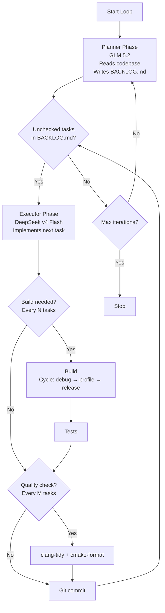

# Agentic Loop — Planner / Executor Architecture

An autonomous coding loop that alternates between a **planner** (expensive,
powerful model) and an **executor** (cheap, fast model) to continuously
improve the Kataglyphis-BeschleunigerBallett graphics engine.

Two engines are supported (select via `engine` in the config, `--engine` /
`-Engine` on the runner scripts, or `AGENTIC_ENGINE` in the environment):

| Engine | Planner | Executor | CLI |
| --- | --- | --- | --- |
| `claude` (default) | Claude Fable 5 (`claude-fable-5`), falls back to Opus 4.8 (`claude-opus-4-8`) when overloaded | Claude Sonnet (`claude-sonnet-5`) | [Claude Code](https://claude.com/claude-code) `claude -p` |
| `opencode` | GLM 5.2 | DeepSeek v4 Flash | [OpenCode](https://opencode.ai) `opencode run` |

The reusable loop logic lives in the
[Kataglyphis-ContainerHub](../../ExternalLib/Kataglyphis-ContainerHub)
submodule (`linux/scripts/lib/agentic-loop.sh` and
`windows/scripts/modules/WindowsAgenticLoop.Common.psm1`); the scripts here
are thin project-specific wrappers.

## Architecture



### Key Design Principles

1. **Queue discipline**: The executor must drain ALL unchecked tasks in
   `BACKLOG.md` before the planner adds new ones. While tasks are pending,
   the planner phase is skipped entirely
   (`backlog.skipPlannerWhenTasksPending`) — iterations go straight to the
   executor. Completed tasks are deleted from the backlog
   (`backlog.deleteCompletedTasks`); their summaries live in the git
   commit messages, so `BACKLOG.md` only ever contains open work.

2. **Model tiering**: The planner uses an expensive, powerful model (Fable 5
   or GLM 5.2) for high-quality analysis and task descriptions. The executor
   uses a cheaper, faster model (Sonnet or DeepSeek v4 Flash) for
   implementation — it relies on the planner's detailed task descriptions to
   work efficiently.

3. **Build matrix cycling**: After every N completed tasks, a build is
   triggered. The build configuration cycles through a **build matrix** —
   a set of entries each defining a preset, sanitizer, build directory, and
   test command. This ensures the loop exercises ASAN, profile, and release
   builds regularly, not just one build type.

4. **Sanitizer-aware test execution**: When a matrix entry has
   `sanitizer: "asan"` or `sanitizer: "tsan"`, the loop automatically sets
   `ASAN_OPTIONS` or `TSAN_OPTIONS` before running tests, then restores the
   original environment. This ensures sanitizer-instrumented tests actually
   catch memory errors and data races.

5. **Full matrix sweep**: Every N iterations (configurable via
   `fullMatrixEveryNIterations`), the loop runs ALL build configs in
   sequence instead of just one. This ensures every config is exercised
   regularly, not just the one that happens to be next in the cycle.

6. **Periodic quality gates**: clang-tidy and cmake-format run every M
   tasks to catch drift early.

7. **Periodic refactor focus**: Every R iterations, the planner focuses
   exclusively on refactoring tasks (dead code, API consolidation, test
   gaps, documentation drift, C++23 modernization).

8. **Build-failure fixing**: When a periodic build fails, the executor-tier
   model is dispatched with the tail of the build log and a focused
   "fix the build" prompt, then the build is retried once. After
   `maxConsecutiveBuildFailures` consecutive failed build phases the loop
   stops instead of churning.

9. **Retry with backoff + per-role timeouts**: Every agent invocation
   retries up to `agentRetries` times with linear backoff, and the planner /
   executor have independent wall-clock timeouts
   (`plannerTimeoutSeconds` / `executorTimeoutSeconds`).

10. **Planner sandbox (claude engine)**: The planner runs with
    `--allowed-tools "Read Glob Grep Edit(BACKLOG.md) Bash(git:*) PowerShell(git:*)"`,
    so it can analyze everything but only write the backlog. The executor
    runs with `bypassPermissions` (trusted repo). Role system prompts come
    from `prompts/planner.md` / `prompts/executor.md` via
    `--append-system-prompt-file`.

## Files

| File | Purpose |
| --- | --- |
| `Scripts/AgenticLoop/prompts/planner.md` | Engine-neutral planner system prompt (used by the claude engine) |
| `Scripts/AgenticLoop/prompts/executor.md` | Engine-neutral executor system prompt (used by the claude engine) |
| `opencode.json` | OpenCode project config: agent definitions, model bindings, commands |
| `.opencode/agents/planner.md` | Planner agent system prompt (opencode engine) |
| `.opencode/agents/executor.md` | Executor agent system prompt (opencode engine) |
| `.opencode/commands/plan.md` | `/plan` slash command |
| `.opencode/commands/execute.md` | `/execute` slash command |
| `.opencode/commands/build.md` | `/build` slash command |
| `.opencode/commands/test.md` | `/test` slash command |
| `.opencode/commands/quality.md` | `/quality` slash command |
| `Scripts/AgenticLoop/AgenticLoop.config.json` | Loop configuration (models, intervals, build configs) |
| `Scripts/AgenticLoop/Run-AgenticLoop.ps1` | Windows orchestration script (PowerShell) |
| `Scripts/AgenticLoop/Run-AgenticLoop.sh` | Linux orchestration script (Bash) |

## Prerequisites

### Claude Code (claude engine, default)

Install [Claude Code](https://claude.com/claude-code) and log in once
interactively (`claude`). The loop then invokes it headlessly via
`claude -p`.

### OpenCode (opencode engine)

Install OpenCode:

```pwsh
# Windows
scoop install opencode
# or
npm install -g opencode-ai
```

```bash
# Linux
curl -fsSL https://opencode.ai/install | bash
```

Authenticate with your model providers:

```bash
opencode auth login
```

### Container Runtime

- **Windows**: [Stevedore](https://github.com/kataglyphis/Kataglyphis-ContainerHub)
  (Docker) — already configured via `Build-Windows-Container.ps1`.
- **Linux**: [Rancher Desktop](https://rancherdesktop.io/) — provides the
  Docker-compatible CLI for any containerized build steps.

### jq (Linux only)

The Linux script uses `jq` to parse the config:

```bash
sudo apt install jq   # Debian/Ubuntu
```

## Configuration

Edit `Scripts/AgenticLoop/AgenticLoop.config.json`:

```json
{
  "engine": "claude",
  "engines": {
    "claude": {
      "plannerModel": "claude-fable-5",
      "plannerFallbackModel": "claude-opus-4-8",
      "executorModel": "claude-sonnet-5",
      "plannerPromptFile": "Scripts/AgenticLoop/prompts/planner.md",
      "executorPromptFile": "Scripts/AgenticLoop/prompts/executor.md",
      "plannerAllowedTools": "Read Glob Grep Edit(BACKLOG.md) Bash(git:*) PowerShell(git:*)",
      "permissionMode": "bypassPermissions"
    },
    "opencode": {
      "plannerModel": "opencode-go/glm-5.2",
      "executorModel": "opencode-go/deepseek-v4-flash"
    }
  },
  "intervals": {
    "buildEveryNTasks": 3,
    "qualityEveryNTasks": 5,
    "refactorEveryNIterations": 3,
    "fullMatrixEveryNIterations": 5,
    "testAfterBuild": true,
    "maxExecutorRetries": 3,
    "loopDelaySeconds": 10,
    "maxIterations": 0,
    "plannerTimeoutSeconds": 1800,
    "executorTimeoutSeconds": 3600,
    "agentRetries": 2,
    "agentRetryDelaySeconds": 30,
    "fixBuildFailures": true,
    "maxConsecutiveBuildFailures": 3
  },
  "buildMatrix": {
    "windows": [
      {"name": "clangcl-debug", "sanitizer": "asan", "buildDir": "build-clangcl-debug", "buildType": "Debug", "testCommand": "ctest --test-dir build-clangcl-debug --output-on-failure -C Debug"},
      {"name": "clangcl-profile", "sanitizer": "none", "buildDir": "build-clangcl-profile", "buildType": "RelWithDebInfo", "testCommand": "ctest --test-dir build-clangcl-profile --output-on-failure -C RelWithDebInfo"},
      {"name": "clangcl-release", "sanitizer": "none", "buildDir": "build-clangcl-release", "buildType": "Release", "testCommand": null}
    ],
    "linux": [
      {"name": "linux-debug-asan-clang", "sanitizer": "asan", "buildDir": "build-asan-clang", "buildType": "Debug", "testCommand": "ctest --test-dir build-asan-clang --output-on-failure -C Debug"},
      {"name": "linux-debug-tsan-clang", "sanitizer": "tsan", "buildDir": "build-tsan-clang", "buildType": "Debug", "testCommand": "ctest --test-dir build-tsan-clang --output-on-failure -C Debug"},
      {"name": "linux-profile-clang", "sanitizer": "none", "buildDir": "build-profile-clang", "buildType": "RelWithDebInfo", "testCommand": "ctest --test-dir build-profile-clang --output-on-failure -C RelWithDebInfo"},
      {"name": "linux-release-clang", "sanitizer": "none", "buildDir": "build-release-clang", "buildType": "Release", "testCommand": null}
    ]
  }
}
```

See [`ExternalLib/Kataglyphis-ContainerHub/docs/agentic-loop-build-matrix.md`](../../ExternalLib/Kataglyphis-ContainerHub/docs/agentic-loop-build-matrix.md)
for the full build matrix documentation.

### Model IDs

| Engine | Role | Model ID | Notes |
| --- | --- | --- | --- |
| claude | Planner | `claude-fable-5` | Fable 5 — most capable; `claude-opus-4-8` configured as fallback |
| claude | Executor | `claude-sonnet-5` | Sonnet — fast, cheap, strong at implementation |
| opencode | Planner | `opencode-go/glm-5.2` | GLM 5.2 — powerful, expensive |
| opencode | Executor | `opencode-go/deepseek-v4-flash` | DeepSeek v4 Flash — cheap, fast |

OpenCode model IDs use the `provider/model-id` format — run
`opencode models` to see what is available.

Environment overrides (both engines, both platforms):

```pwsh
$env:AGENTIC_ENGINE = "claude"           # or "opencode"
$env:AGENTIC_PLANNER_MODEL = "claude-opus-4-8"
$env:AGENTIC_EXECUTOR_MODEL = "claude-sonnet-5"
```

## Usage

### Full loop (Windows)

```pwsh
pwsh -ExecutionPolicy Bypass -File .\Scripts\AgenticLoop\Run-AgenticLoop.ps1
```

### Full loop (Linux)

```bash
./Scripts/AgenticLoop/Run-AgenticLoop.sh
```

### Switch engines

```pwsh
# Windows — run with OpenCode instead of the default (claude)
pwsh -ExecutionPolicy Bypass -File .\Scripts\AgenticLoop\Run-AgenticLoop.ps1 -Engine opencode
```

```bash
# Linux
./Scripts/AgenticLoop/Run-AgenticLoop.sh --engine opencode
```

### Dry run (see what would happen)

```pwsh
pwsh -ExecutionPolicy Bypass -File .\Scripts\AgenticLoop\Run-AgenticLoop.ps1 -DryRun
```

### Planner only (add tasks without executing)

```pwsh
pwsh -ExecutionPolicy Bypass -File .\Scripts\AgenticLoop\Run-AgenticLoop.ps1 -PlannerOnly
```

### Executor only (drain current queue)

```pwsh
pwsh -ExecutionPolicy Bypass -File .\Scripts\AgenticLoop\Run-AgenticLoop.ps1 -ExecutorOnly
```

### Limited iterations

```pwsh
pwsh -ExecutionPolicy Bypass -File .\Scripts\AgenticLoop\Run-AgenticLoop.ps1 -MaxIterations 5
```

### Skip builds/tests/quality (fast planning cycle)

```pwsh
pwsh -ExecutionPolicy Bypass -File .\Scripts\AgenticLoop\Run-AgenticLoop.ps1 -SkipBuild -SkipTests -SkipQuality
```

### Interactive OpenCode commands

You can also use the slash commands directly in the OpenCode TUI:

```
/plan          — run the planner
/execute       — execute the next task
/build debug   — build with a specific preset
/test          — run tests
/quality       — run clang-tidy + cmake-format
```

## Logging

All loop output is logged to `logs/agentic-loop/agentic-loop_<timestamp>.log`.
Each log entry includes a timestamp and level. OpenCode output, build output,
test output, and quality output are all captured in the log file.

## How It Works

### 1. Planner Phase

The orchestration script invokes (depending on the engine):

```
claude -p --model claude-fable-5 --fallback-model claude-opus-4-8 \
  --append-system-prompt-file Scripts/AgenticLoop/prompts/planner.md \
  --allowed-tools Read Glob Grep "Edit(BACKLOG.md)" "Bash(git:*)" "PowerShell(git:*)"
# or
opencode run --agent planner --model opencode-go/glm-5.2
```

The planner agent (role prompt in `prompts/planner.md` /
`.opencode/agents/planner.md`):
- Has read access to the entire codebase
- Has write access only to `BACKLOG.md`
- Analyzes the codebase for bugs, improvements, missing tests, and debt
- Writes detailed task entries with file paths, steps, test guidance, and
  build instructions
- Every R iterations, focuses on refactor tasks

### 2. Executor Phase

The script counts unchecked tasks (`- [ ]`) in `BACKLOG.md` and loops:

```
claude -p --model claude-sonnet-5 --dangerously-skip-permissions \
  --append-system-prompt-file Scripts/AgenticLoop/prompts/executor.md
# or
opencode run --agent executor --model opencode-go/deepseek-v4-flash
```

The executor agent (role prompt in `prompts/executor.md` /
`.opencode/agents/executor.md`):
- Has full tool access (read, write, bash)
- Picks up the first unchecked task
- Implements the changes following the task description
- Builds with the appropriate preset
- Marks the task as `[x]` with a summary
- Commits the changes

The loop continues until all tasks are drained or max retries are hit.

### 3. Build Phase

After every N completed tasks, a build is triggered. The configuration
cycles through the `buildMatrix` array, so consecutive builds use
different presets:

| Build # | Windows | Linux |
| --- | --- | --- |
| 1 | `clangcl-debug` (ASAN) | `linux-debug-asan-clang` (ASAN) |
| 2 | `clangcl-profile` | `linux-debug-tsan-clang` (TSan) |
| 3 | `clangcl-release` | `linux-profile-clang` |
| 4 | `clangcl-debug` (cycles back) | `linux-release-clang` |
| 5 | `clangcl-profile` | `linux-debug-asan-clang` (cycles back) |

On Windows, builds go through the Stevedore container script
(`Build-Windows-Container.ps1`). On Linux, through the native build script
(`cmake-configure-build.sh`) via Rancher Desktop.

Every N iterations (configurable via `fullMatrixEveryNIterations`), a
**full matrix sweep** runs ALL configs in sequence instead of just one.

### 4. Test Phase

After each successful build, tests run via `ctest`. When the build matrix
entry has `sanitizer: "asan"` or `sanitizer: "tsan"`, the loop
automatically sets `ASAN_OPTIONS` or `TSAN_OPTIONS` before running tests,
then restores the original environment. This ensures sanitizer-instrumented
tests actually catch memory errors and data races.

| Sanitizer | Env Var | Value |
| --- | --- | --- |
| `asan` | `ASAN_OPTIONS` | `detect_leaks=1:halt_on_error=1:abort_on_error=1:allocator_may_return_null=1` |
| `tsan` | `TSAN_OPTIONS` | `halt_on_error=1:abort_on_error=1:second_deadlock_stack=1` |
| `none` | — | No env vars set |

### 5. Quality Phase

Every M tasks, clang-tidy and cmake-format run to catch formatting drift
and static analysis issues.

## Suggestions and Best Practices

1. **Start with a dry run** to verify the configuration before committing
   to a long loop.

2. **Use `opencode stats`** to monitor token usage and costs:
   ```bash
   opencode stats --days 1 --models 5
   ```

3. **Set `maxIterations`** for controlled runs. Start with 3-5 iterations
   and increase once you trust the loop.

4. **Review `BACKLOG.md`** after each planner cycle. The planner is
   powerful but not perfect — remove tasks that don't make sense.

5. **Check the log file** after each run for build failures or executor
   stalls. The log captures all OpenCode, build, test, and quality output.

6. **Use `ExecutorOnly`** to resume a drained queue if the loop was
   interrupted mid-execution.

7. **Use `PlannerOnly`** to batch-plan tasks for later execution.

8. **Git history**: Each completed task gets its own commit with the
   `agentic-loop:` prefix, making it easy to review and revert.

9. **Cost control**: The planner is the expensive model. Limit its
   frequency by increasing `refactorEveryNIterations` and keeping the
   task count per cycle low (the planner prompt caps at 5 tasks).

10. **Build failure handling**: If a build fails, the executor should
    attempt to fix it. If it can't after `maxExecutorRetries` attempts,
    the loop moves on to the next planning cycle rather than spinning.

## Troubleshooting

| Problem | Solution |
| --- | --- |
| `claude: command not found` | Install Claude Code (native installer or `npm install -g @anthropic-ai/claude-code`) |
| claude authentication error | Run `claude` once interactively to log in |
| `opencode: command not found` | Install OpenCode: `scoop install opencode` (Windows) or `curl -fsSL https://opencode.ai/install \| bash` (Linux) |
| `jq: command not found` (Linux) | `sudo apt install jq` |
| Model not found | Run `opencode models` to list available models; adjust IDs in config |
| Build fails in container | Check the log file; ensure the Stevedore container image is pulled |
| Executor stuck on a task | The loop will retry `maxExecutorRetries` times, then skip to the next cycle |
| BACKLOG.md not updating | Ensure the planner agent has write permission; check `opencode.json` permissions |
| Rancher Desktop not detected | Ensure `docker` or `nerdctl` is on PATH; start Rancher Desktop |