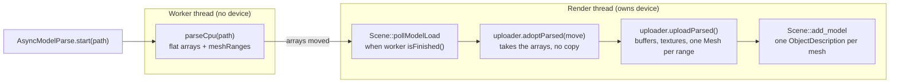

# Model loading

How a model file becomes drawable geometry in the Vulkan engine: the two
loaders, the async parse/upload split that keeps the frame loop responsive, and
the multi-mesh flow that turns one file into per-mesh draws. This is the
architecture reference; `docs/cpp-renderer-improvements.md` carries the
chronological change log.

## Two loaders, one shape

`ObjLoader` (`scene/ObjLoader.{ixx,cpp}`) and `GltfLoader`
(`scene/GltfLoader.{ixx,cpp}`) load `.obj` and `.gltf`/`.glb` respectively into
the SAME CPU-side arrays, so everything downstream is loader-agnostic. Both
expose the same three-part interface:

- `parseCpu(path)` — reads and decodes the file into flat arrays
  (`vertices`, `indices`, per-triangle `materialIndex`, `materials`, plus a
  per-mesh `meshRanges` table, see below). Touches **no Vulkan**, so it can run
  on any thread.
- `uploadParsed()` — builds the Vulkan-side `Model` from the last `parseCpu`
  result (buffers, textures, meshes). **Must** run on the thread that owns the
  device.
- `adoptParsed(other&&)` — moves another loader's parse results in, so a
  device-owning loader can upload what a device-free worker produced without
  copying the (tens-of-MB) arrays.

`loadModel(path)` is just `parseCpu` + `uploadParsed` for the synchronous path.

### Which nodes a glTF load walks

`GltfLoader::parseCpu` walks a single scene, not every node in the document:
the document's default scene (`data->scene`) if it names one, else the first
entry of `data->scenes`. Only nodes reachable from that scene's roots are
loaded; a node no scene references is skipped. A document with no `scenes`
array at all (`cgltf_validate` permits this) falls back to every node, with a
warning, since that is the only geometry available. This mirrors the WebGPU
Rust loader's `default_scene().or_else(|| scenes().next())` rule
(`crates/webgpu_renderer/src/asset/gltf_loader.rs`) — the two must be kept in
sync.

## The async parse/upload split

The parse dominates load time — a measured 2802 ms of a 2818 ms load on the
bundled 27 MB `dinosaurs.obj` is device-free work — so it moves off the render
thread:

1. `AsyncModelParse` (`scene/AsyncModelParse.ixx`) runs `parseCpu` on a worker
   thread against a fresh device-free loader (`ObjLoader{}` / `GltfLoader{}`),
   dispatched by file extension via `isGltfModelPath` (`scene/ModelFileKind.ixx`).
   `Scene::loadModel` routes through the same predicate.
2. When the worker finishes, `Scene::pollModelLoad` (`scene/Scene.cpp`, the
   `pendingModelParse.parsedGltf()` branch) takes the worker's loader, hands it
   to a **device-owning** uploader via `adoptParsed`, and calls `uploadParsed` —
   the only ~15 ms the frame loop pays. Both arms (glTF, OBJ) are symmetric.

So `adoptParsed` must move every field `uploadParsed` reads, including
`meshRanges` — miss one and the async path silently loads different geometry
than the synchronous one.



The synchronous `loadModel(path)` is the same minus the thread hop: `parseCpu`
then `uploadParsed` back-to-back on the calling (device-owning) thread.

## One file, many meshes

A `Model` holds `std::vector<Mesh>` (`scene/Model.ixx`). A single file becomes a
multi-mesh model through a per-mesh **`MeshRange`** — a slice of the flat arrays:

```
struct MeshRange {
    vertexBase, vertexCount, indexStart, indexCount, triStart, triCount, doubleSided
};
```

`doubleSided` carries glTF `material.doubleSided` per range, so `uploadParsed`
can hand it to `add_new_mesh` and the raster pass can disable back-face culling
for that mesh alone; it is always `false` for OBJ, which has no such concept.

The type lives in its own module, `kataglyphis.vulkan.mesh_range`
(`scene/MeshRange.ixx`), `export import`ed by both loaders. It exports
`MeshRange`, the `MeshSlice` return type, and `sliceMeshRange` — the single
shared implementation of "sub-vertices copied, sub-indices re-based by
`-vertexBase`, per-range material subset" that both loaders' `uploadParsed`
call into rather than each doing the slicing themselves.

`parseCpu` records one range per sub-object while keeping the flat arrays intact
(so the `ObjParseUnit`/`GltfParseUnit` tests still assert on the flat getters),
and `uploadParsed` slices each range via `sliceMeshRange` into its own
`add_new_mesh`. What a "sub-object" is differs by format:

- **glTF** — one range per **primitive**. Primitives already parse into disjoint
  contiguous vertex ranges, so recording the range is direct.
- **OBJ** — one range per **shape** (`o`/`g` group). OBJ shapes share one
  attribute pool and vertices are deduplicated, so `loadVertices` resets the
  dedup map **per shape** to keep each shape's vertices in a contiguous block the
  slice can address. The cost is duplicating any vertex shared across distinct
  shapes (rare between separate objects, and pixel-identical either way).

A single-primitive glTF or single-shape OBJ yields exactly one range spanning
everything — behaviour-identical to the pre-split single-mesh path.

## What downstream gets for free

Because object identity is per **mesh**, not per model, splitting a file into
meshes automatically feeds the systems that were already made mesh-aware:

- **Object descriptions** — `Scene::add_model` flattens one `ObjectDescription`
  per mesh; `objectIndex` is the flat mesh index (sum of prior models' mesh
  counts + local index), pushed per draw in the forward/deferred/shadow record
  loops.
- **Culling** — the record loops iterate meshes with per-mesh AABBs, so a
  multi-mesh model culls at mesh granularity instead of all-or-nothing.
- **Acceleration structures** — one BLAS per model with one **geometry** per
  mesh; RT/PT kernels fetch the per-mesh material with
  `instanceCustomIndex (= the model's first-mesh flat index) + gl_GeometryIndexEXT`.

## Material fields and where they come from

`ObjMaterial` (`Src/shared/scene/ObjMaterial.hpp`) is the single struct both
loaders fill and every shader reads. `fromGltfMaterial` (`GltfLoader.cpp`) is
the glTF mapping; `ObjLoader::loadTexturesAndMaterials` is the `.mtl` mapping.
A `—` means that format has no source for the field, so the struct keeps its
default (documented on the member itself in `ObjMaterial.hpp`).

| Member | glTF source | `.mtl` source | Read by |
| --- | --- | --- | --- |
| `diffuse` | `pbrMetallicRoughness.baseColorFactor.rgb`; `(0.8, 0.8, 0.8)` if the material has no `pbrMetallicRoughness` block | `Kd` | `rasterizer.slang`, `deferred.slang`, `raytrace.rchit.slang`, `path_tracing.slang` (untextured fallback / `base_color()` blend) |
| `emission` | `emissiveFactor` | `Ke` | `rasterizer.slang` (`color += material.emission`), `deferred.slang` (packed into the G-buffer's `.gba`) |
| `shininess` | — (only ever set to a derived `mix(128, 1, roughnessFactor)` value, kept as the OBJ-only fallback `material_roughness()` falls back to) | `Ns` | `material_fetch.slang`'s `material_roughness()`, OBJ materials only |
| `dissolve` | `baseColorFactor.a` | `d` | `material_fetch.slang`'s `alpha_masked_out()` |
| `textureID` | dedup'd slot into `textureImages` (`imageSlot` map, keyed on `(const cgltf_image *, const cgltf_sampler *, bool srgb)`) | dedup'd slot into `textures` (`pathSlot` map, keyed on the resolved texture path) | all five entry points, via `texture_offset + material.textureID` (see below) |
| `sampler` (not an `ObjMaterial` field — tracked separately, index-parallel with `textureImages`, via `GltfLoader::getTextureSamplerDescs()`) | `textures[].sampler`'s wrap modes and mag/min/mipmap filters, mapped to `GltfSamplerDesc` (`vulkan_base/SamplerBuilder.ixx`) | — (OBJ has no sampler concept; every OBJ texture keeps the repeat/linear/linear default) | `Model::addSampler`, when building the texture's `vk::Sampler` |
| `srgb` (not an `ObjMaterial` field — tracked separately, index-parallel with `textureImages`, via `GltfLoader::getTextureSrgbFlags()`) | `true` for base-colour/emissive views, `false` for the normal-map view | — (OBJ textures always upload sRGB) | `Texture::createFromMemory`/`createFromFile`, selecting `eR8G8B8A8Srgb` vs. `eR8G8B8A8Unorm` |
| `alphaCutoff` | `material.alpha_cutoff` when `alphaMode == MASK`, else `-1` | — | `material_fetch.slang`'s `alpha_masked_out()`, `shadow_map.slang` |
| `uv_transform_row0` / `uv_transform_row1` | `KHR_texture_transform`'s T\*R\*S rows on the base-colour texture; identity rows if the extension is absent | — | `base_color.slang`'s `transform_uv()` |
| `metallic` | `pbrMetallicRoughness.metallicFactor`, clamped `[0,1]` | — | `rasterizer.slang`/`raytrace.rchit.slang` (`f0`, `brdf_direct`), `deferred.slang` (G-buffer normal's `.a`) |
| `roughness` | `pbrMetallicRoughness.roughnessFactor`, clamped `[0,1]`; `-1` sentinel ("unauthored") when the material has no `pbrMetallicRoughness` block | — | `material_fetch.slang`'s `material_roughness()` |
| `emissiveTextureID` | dedup'd slot into `textureImages` (same `imageSlot` map as `textureID` — an emissive view naming the same `(image, sampler)` pair as the base-colour view lands on the same slot); `-1` if the material has no `emissiveTexture` | — | all four shading paths, via `common/emission.slang`'s `material_emission()` |
| `normalTextureID` | dedup'd slot into `textureImages` (same `imageSlot` map as `textureID`/`emissiveTextureID`); `-1` if the material has no `normalTexture` | — | all four shading paths, via `common/normal_map.slang`'s `apply_normal_map()`, using `Vertex::tangent` for the TBN basis |

## Textures, samplers and the 128-slot budget

<!-- max-texture-count: 128 -->

Every texture from every loaded model lands in one flat, fixed-size global
array bound at `TEXTURES_BINDING`/`SAMPLER_BINDING`, sized by
`common/host_device_shared_vars.hpp`'s `MAX_TEXTURE_COUNT` constant:
`const int MAX_TEXTURE_COUNT = 128;`. Both loaders actively economise
against that budget rather than just hoping models stay small:

- **glTF dedup by image, sampler and colour space** —
  `GltfLoader::parseCpu`'s `imageSlot` map keys on the triple
  `(const cgltf_image *, const cgltf_sampler *, bool srgb)`, not the material
  or the texture slot (base-colour vs. emissive vs. normal): one
  decode+upload per (image, sampler, colour space) triple no matter how many
  materials or texture slots reference it (e.g. a material whose base-colour
  and emissive views name the same PNG share one slot — `textureID ==
  emissiveTextureID`), while two textures that share an image but name
  different samplers, or that need different colour spaces, still get
  distinct slots — collapsing those would make the second texture's
  wrap/filter settings unobservable, or upload one of the two through the
  wrong `VkFormat`. A base-colour/normal pair sharing one image therefore
  gets **two** slots: one uploaded sRGB (`Texture.cpp`'s `uploadRgba` picks
  `eR8G8B8A8Srgb`), the other UNORM (`eR8G8B8A8Unorm`) — glTF normal maps are
  linear tangent-space data, not gamma-encoded colour.
- **OBJ dedup by resolved path** — `ObjLoader::loadTexturesAndMaterials`'s
  `pathSlot` map keys on the path `resolveObjTexturePath` returns, not the
  raw `map_Kd` string, so two materials naming the same file through
  different `.mtl` spellings (`tex.png` vs `./tex.png`) still collapse onto
  one slot.
- **A failed texture still occupies its slot** — when `Texture::createFromFile`
  fails for a non-empty name, `ObjLoader::uploadParsed`'s
  `addTextureOrDefault` call substitutes the default texture rather than
  skipping the slot, because `textureID` is a dense counter over non-empty
  names and skipping would shift every later `textureID` down by one.
- **Sampler dedup by mip level and glTF sampler description** —
  `Model::addSampler` (`scene/Model.cpp`) keys on a `SamplerKey{ mipLevel,
  GltfSamplerDesc }` via `findSampler` (`vulkan_base/SamplerBuilder.cpp`): N
  textures share one `vk::Sampler` only when both their mip count and their
  wrap/filter settings match, instead of one sampler per texture.
- **Flattening into the global array** — `assignTextureOffsets`
  (`scene/ObjectDescription.ixx`) stamps each mesh's `texture_offset` with
  its model's running offset into the flattened array, advancing by that
  model's texture count once its meshes are done; `planFlattenedTextureSlots`
  (`scene/ObjectDescription.ixx`) is the mirror image that actually builds
  the array, model order, capped at `MAX_TEXTURE_COUNT` and padded with slot
  0 past the cap. On the shader side, all five entry points
  (`rasterizer`, `deferred`, `shadow_map`, `path_tracing`, `raytrace.rchit`)
  compute `textureId` the same way and clamp it —
  `clamp(int(obj.texture_offset) + material.textureID, 0, MAX_TEXTURE_COUNT - 1)`
  — so a model that pushes the total past budget samples a wrong (but
  in-bounds) slot instead of reading out of the descriptor array.

Both loaders also emit per-vertex colours (glTF `COLOR_0`, handled in
`GltfLoader::processPrimitive`'s attribute switch; OBJ `attrib.colors`, read
in `ObjLoader::loadVertices`) and fill in missing normals via the shared
`scene/Vertex.{ixx,cpp}` module, but not through the same function:
`GltfLoader::processPrimitive` calls `computeFlatNormals` when a primitive
has no `NORMAL` accessor, recomputing every corner; `ObjLoader::loadVertices`
calls the sibling `fillMissingFlatNormals`, which only fills the corners left
at a zero normal (so a file with no `vn` at all behaves like
`computeFlatNormals`, but a file with `vn` on only some faces leaves the rest
untouched).

## `map_Kd` texture path resolution

Both loaders resolve an OBJ material's `map_Kd` the same way:

**Normalise `\` to `/` in the `map_Kd` value; resolve the result relative to
the directory containing the `.mtl`; if that file does not exist, retry under
a `textures/` subdirectory of the same directory; if that misses too, warn
and fall back to the default texture.**

The `\`-to-`/` normalisation is a deliberate deviation from "as written in
the `.mtl`": a Windows-authored relative path (`textures\wood.png`) must
still resolve when the `.mtl` is loaded on a platform where `\` is just
another filename character. Relative-to-the-`.mtl` first is what the OBJ/MTL
format actually specifies; the `textures/` retry exists because every OBJ
shipped in `Resources/Models` (`crytek-sponza`, `Pillum`, `Sulo`/`WolfStahl`,
`VikingRoom`) puts its textures in a `textures/` sibling directory and
references them by bare filename, not by the format's own convention. A path
that resolves to neither candidate degrades silently to the untextured
default (Vulkan) or a missing image (glTF) rather than failing the whole load
- so both sides log a warning naming both candidates, which is the only
signal a wrong or missing texture leaves behind. An empty base directory (a
bare filename with no directory component) is treated as `.` on both sides,
so the candidates stay relative instead of resolving against the filesystem
root.

- **C++** (`scene/ObjLoader.cpp`, `resolveObjTexturePath`) - builds both
  candidate paths and records the first that `std::filesystem::exists`.
- **Rust** (`crates/webgpu_renderer/src/asset/obj_to_gltf.rs`,
  `convert_file`) - same two candidates, applied when copying the texture
  next to the converted glTF. The glTF `uri` it emits is always the bare
  filename as written in the `.mtl`, regardless of which candidate matched,
  so the converted document stays self-contained next to its `.bin`.

## Invariants worth preserving

- `parseCpu` leaves the flat `getVertices()`/`getIndices()`/
  `getMaterialIndices()`/`getMaterials()` exactly as before the split — the CPU
  parse tests key on them, and the slice reads from them.
- Every `MeshRange` must tile the flat arrays contiguously (no gap/overlap) and
  every index in a range must stay inside that range's own vertex block, or the
  `-vertexBase` re-base in `sliceMeshRange` corrupts the mesh. The
  `MultiShape…`/`MultiPrimitive…RecordsPerPrimitiveMeshRanges` parse tests assert
  this at the parse level, and `Test/commit/VulkanEngine/meshRangeSliceSuite.cpp`
  unit-tests `sliceMeshRange` itself directly, so the invariant has both a
  parse-level and a slice-level test.
- Each mesh currently shares the full `materials` array (its `materialIndex`
  holds the original indices). Trimming to a per-mesh material subset is an
  optional optimisation tracked in the backlog; since the slice loop is already
  shared in `sliceMeshRange`, that trim would edit exactly one place for both
  loaders.
