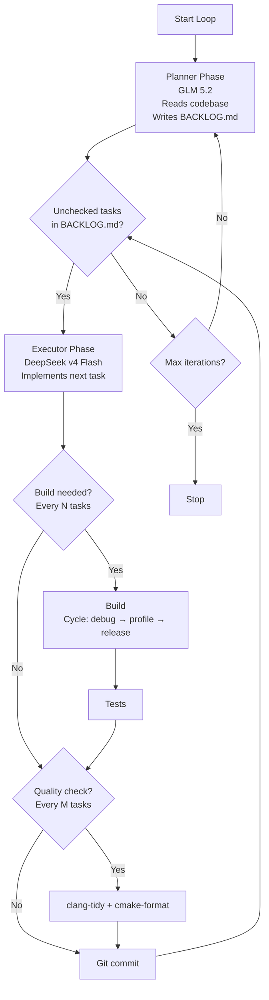

# Agentic Loop — Planner / Executor Architecture

An autonomous coding loop that alternates between a **planner** (expensive,
powerful model) and an **executor** (cheap, fast model) to continuously
improve the BeschleunigerBallett graphics engine.

Two engines are supported (select via `engine` in the config, `--engine` /
`-Engine` on the runner scripts, or `AGENTIC_ENGINE` in the environment):

| Engine | Planner | Executor | CLI |
| --- | --- | --- | --- |
| `claude` (default) | Claude Opus 5 (`claude-opus-5`), falls back to Fable 5 (`claude-fable-5`) when overloaded | Claude Sonnet (`claude-sonnet-5`) | [Claude Code](https://claude.com/claude-code) `claude -p` |
| `opencode` | GLM 5.2 | DeepSeek v4 Flash | [OpenCode](https://opencode.ai) `opencode run` |

The reusable loop logic lives in the
[ContainerHub](../../third_party/ContainerHub)
submodule (`linux/scripts/lib/agentic-loop.sh` and
`windows/scripts/modules/WindowsAgenticLoop.Common.psm1`); the scripts here
are thin project-specific wrappers.

## Architecture



### Key Design Principles

1. **Queue discipline**: The executor must drain ALL actionable tasks in
   `BACKLOG.md` before the planner adds new ones. While actionable (`- [ ]`)
   tasks are pending, the planner phase is skipped entirely
   (`backlog.skipPlannerWhenTasksPending`) — iterations go straight to the
   executor. Completed tasks are deleted from the backlog
   (`backlog.deleteCompletedTasks`); their summaries live in the git
   commit messages, so `BACKLOG.md` only ever contains open work.
2. **Blocked tasks don't starve the planner**: tasks waiting on a
   prerequisite or an owner decision are marked `- [b]` (by the executor when
   it discovers the blocker, or by the planner when recording one). They are
   excluded from the pending count, so a backlog containing only blocked
   entries reads as an empty queue and the planner runs again. As a backstop,
   an iteration that completes zero tasks forces the planner to run on the
   next iteration, and if the planner ran and the executor still made no
   progress the loop stops instead of burning sessions re-auditing the same
   entries (this exact failure mode cost a 7.6 h zero-progress run on
   2026-07-31).

3. **Model tiering**: The planner uses an expensive, powerful model (Opus 5
   or GLM 5.2) for high-quality analysis and task descriptions. The executor
   uses a cheaper, faster model (Sonnet or DeepSeek v4 Flash) for
   implementation — it relies on the planner's detailed task descriptions to
   work efficiently.

4. **Build matrix cycling, sanitizer-aware tests, full sweeps**: After
   every N completed tasks a build is triggered, cycling through the
   config's `buildMatrix` (ASAN, TSan, profile, and release entries);
   entries with a sanitizer get `ASAN_OPTIONS`/`TSAN_OPTIONS` set around
   their tests, and every `fullMatrixEveryNIterations` iterations ALL
   configs build in sequence instead of just one. Cycling order, env-var
   values, and entry semantics are documented once in
   [`agentic-loop-build-matrix.md`](../../third_party/ContainerHub/docs/agentic-loop-build-matrix.md).

5. **Periodic quality gates**: clang-tidy and cmake-format run every M
   tasks to catch drift early.

6. **Periodic refactor focus**: Every R iterations, the planner focuses
   exclusively on refactoring tasks (dead code, API consolidation, test
   gaps, documentation drift, C++23 modernization).

7. **Build-failure fixing**: When a periodic build fails, the executor-tier
   model is dispatched with the tail of the build log and a focused
   "fix the build" prompt, then the build is retried once. After
   `maxConsecutiveBuildFailures` consecutive failed build phases the loop
   stops instead of churning.

8. **Retry with backoff + per-role timeouts**: Every agent invocation
   retries up to `agentRetries` times with linear backoff, and the planner /
   executor have independent wall-clock timeouts
   (`plannerTimeoutSeconds` / `executorTimeoutSeconds`).

9. **Planner sandbox (claude engine)**: The planner runs with
    `--allowed-tools "Read Glob Grep Edit(BACKLOG.md) Bash(git:*) PowerShell(git:*)"`,
    so it can analyze everything but only write the backlog. The executor
    runs with `bypassPermissions` (trusted repo). Role system prompts come
    from `prompts/planner.md` / `prompts/executor.md` via
    `--append-system-prompt-file`.

10. **Single-sourced task prompts**: the per-phase TASK prompts (the
    planner / refactor-planner / executor instructions piped to each
    invocation) live in ContainerHub at
    `shared/agentic-loop/prompts/{planner,refactor-planner,executor}.md` —
    the single source of truth read by both the PowerShell module
    (`Get-AgenticDefaultPrompt`) and the Bash library
    (`default_*_prompt`). The wrapper scripts here pass no prompt text;
    `Invoke-AgenticLoop`'s prompt parameters are optional and default to
    those files. These are distinct from the engine-neutral SYSTEM prompts
    in `scripts/agentic-loop/prompts/` (principle 9), which stay
    project-owned.

## Files

| File | Purpose |
| --- | --- |
| `scripts/agentic-loop/prompts/planner.md` | Engine-neutral planner SYSTEM prompt (claude engine, via `--append-system-prompt-file`; project-owned) |
| `scripts/agentic-loop/prompts/executor.md` | Engine-neutral executor SYSTEM prompt (claude engine, via `--append-system-prompt-file`; project-owned) |
| `third_party/ContainerHub/shared/agentic-loop/prompts/{planner,refactor-planner,executor}.md` | Default per-phase TASK prompts — single source of truth for both the PowerShell module and the Bash library |
| `opencode.json` | OpenCode project config: agent definitions, model bindings, commands |
| `.opencode/agents/planner.md` | Planner agent system prompt (opencode engine) |
| `.opencode/agents/executor.md` | Executor agent system prompt (opencode engine) |
| `.opencode/commands/plan.md` | `/plan` slash command |
| `.opencode/commands/execute.md` | `/execute` slash command |
| `.opencode/commands/build.md` | `/build` slash command |
| `.opencode/commands/test.md` | `/test` slash command |
| `.opencode/commands/quality.md` | `/quality` slash command |
| `scripts/agentic-loop/AgenticLoop.config.json` | Loop configuration (models, intervals, build configs) |
| `scripts/agentic-loop/Run-AgenticLoop.ps1` | Windows orchestration script (PowerShell) |
| `scripts/agentic-loop/Run-AgenticLoop.sh` | Linux orchestration script (Bash) |

## Prerequisites

### Claude Code (claude engine, default)

Install [Claude Code](https://claude.com/claude-code) and log in once
interactively (`claude`). The loop then invokes it headlessly via
`claude -p`.

### OpenCode (opencode engine)

Install OpenCode:

```pwsh
# Windows
scoop install opencode
# or
npm install -g opencode-ai
```

```bash
# Linux
curl -fsSL https://opencode.ai/install | bash
```

Authenticate with your model providers:

```bash
opencode auth login
```

### Container Runtime

- **Windows**: [Stevedore](https://github.com/kataglyphis/ContainerHub)
  (Docker) — already configured via `Build-Windows-Container.ps1`.
- **Linux**: [Rancher Desktop](https://rancherdesktop.io/) — provides the
  Docker-compatible CLI for any containerized build steps.

### jq (Linux only)

The Linux script uses `jq` to parse the config:

```bash
sudo apt install jq   # Debian/Ubuntu
```

## Configuration

The live config is [`scripts/agentic-loop/AgenticLoop.config.json`](AgenticLoop.config.json).
Its shape, abbreviated:

```json
{
  "engine": "claude",
  "engines": { "claude": { "...": "models, prompt files, tool sandbox" } },
  "intervals": { "buildEveryNTasks": 3, "...": "cadences, timeouts, retries" },
  "buildMatrix": { "windows": ["..."], "linux": ["..."] }
}
```

Key-by-key semantics live in ContainerHub's
[`windows-agentic-loop.md`](../../third_party/ContainerHub/docs/windows-agentic-loop.md)
(config table); `buildMatrix` entry fields and behaviour in
[`agentic-loop-build-matrix.md`](../../third_party/ContainerHub/docs/agentic-loop-build-matrix.md).
Values this project sets deliberately (rather than inheriting defaults):

- `buildEveryNTasks: 3`, `qualityEveryNTasks: 5`,
  `refactorEveryNIterations: 3`, `fullMatrixEveryNIterations: 5` — the
  build/quality/refactor/sweep cadences.
- `plannerTimeoutSeconds: 1800`, `executorTimeoutSeconds: 3600` — per-role
  wall-clock timeouts (the module default is no timeout).
- `agentRetries: 2` with `agentRetryDelaySeconds: 30`, plus
  `fixBuildFailures: true` / `maxConsecutiveBuildFailures: 3`.
- The `buildMatrix` maps the repo's clangcl (Windows) and clang
  ASAN/TSan/profile/release (Linux) presets to their build dirs and `ctest`
  commands (release entries skip tests via `testCommand: null`).

### Model IDs

| Engine | Role | Model ID | Notes |
| --- | --- | --- | --- |
| claude | Planner | `claude-opus-5` | Opus 5 — powerful, fast; `claude-fable-5` configured as fallback |
| claude | Executor | `claude-sonnet-5` | Sonnet — fast, cheap, strong at implementation |
| opencode | Planner | `opencode-go/glm-5.2` | GLM 5.2 — powerful, expensive |
| opencode | Executor | `opencode-go/deepseek-v4-flash` | DeepSeek v4 Flash — cheap, fast |

OpenCode model IDs use the `provider/model-id` format — run
`opencode models` to see what is available.

Environment overrides (both engines, both platforms):

```pwsh
$env:AGENTIC_ENGINE = "claude"           # or "opencode"
$env:AGENTIC_PLANNER_MODEL = "claude-fable-5"
$env:AGENTIC_EXECUTOR_MODEL = "claude-sonnet-5"
```

## Usage

### Full loop (Windows)

```pwsh
pwsh -ExecutionPolicy Bypass -File .\scriptsgentic-loop\Run-AgenticLoop.ps1
```

### Full loop (Linux)

```bash
./scripts/agentic-loop/Run-AgenticLoop.sh
```

### Switch engines

```pwsh
# Windows — run with OpenCode instead of the default (claude)
pwsh -ExecutionPolicy Bypass -File .\scriptsgentic-loop\Run-AgenticLoop.ps1 -Engine opencode
```

```bash
# Linux
./scripts/agentic-loop/Run-AgenticLoop.sh --engine opencode
```

### Dry run (see what would happen)

```pwsh
pwsh -ExecutionPolicy Bypass -File .\scriptsgentic-loop\Run-AgenticLoop.ps1 -DryRun
```

### Planner only (add tasks without executing)

```pwsh
pwsh -ExecutionPolicy Bypass -File .\scriptsgentic-loop\Run-AgenticLoop.ps1 -PlannerOnly
```

### Executor only (drain current queue)

```pwsh
pwsh -ExecutionPolicy Bypass -File .\scriptsgentic-loop\Run-AgenticLoop.ps1 -ExecutorOnly
```

### Limited iterations

```pwsh
pwsh -ExecutionPolicy Bypass -File .\scriptsgentic-loop\Run-AgenticLoop.ps1 -MaxIterations 5
```

### Skip builds/tests/quality (fast planning cycle)

```pwsh
pwsh -ExecutionPolicy Bypass -File .\scriptsgentic-loop\Run-AgenticLoop.ps1 -SkipBuild -SkipTests -SkipQuality
```

### Interactive OpenCode commands

You can also use the slash commands directly in the OpenCode TUI:

```
/plan          — run the planner
/execute       — execute the next task
/build debug   — build with a specific preset
/test          — run tests
/quality       — run clang-tidy + cmake-format
```

## Logging

All loop output is logged to `logs/agentic-loop/agentic-loop_<timestamp>.log`.
Each log entry includes a timestamp and level. OpenCode output, build output,
test output, and quality output are all captured in the log file.

## How It Works

### 1. Planner Phase

The orchestration script invokes (depending on the engine):

```
claude -p --model claude-opus-5 --fallback-model claude-fable-5 \
  --append-system-prompt-file scripts/agentic-loop/prompts/planner.md \
  --allowed-tools Read Glob Grep "Edit(BACKLOG.md)" "Bash(git:*)" "PowerShell(git:*)"
# or
opencode run --agent planner --model opencode-go/glm-5.2
```

The task prompt piped into the invocation is the shared default
`shared/agentic-loop/prompts/planner.md` from ContainerHub
(`refactor-planner.md` on refactor iterations) — the wrapper scripts no
longer hard-code any prompt text.

The planner agent (role prompt in `prompts/planner.md` /
`.opencode/agents/planner.md`):
- Has read access to the entire codebase
- Has write access only to `BACKLOG.md`
- Analyzes the codebase for bugs, improvements, missing tests, and debt
- Writes detailed task entries with file paths, steps, test guidance, and
  build instructions
- Every R iterations, focuses on refactor tasks

### 2. Executor Phase

The script counts actionable tasks (`- [ ]`, excluding blocked `- [b]`) in
`BACKLOG.md` and loops:

```
claude -p --model claude-sonnet-5 --dangerously-skip-permissions \
  --append-system-prompt-file scripts/agentic-loop/prompts/executor.md
# or
opencode run --agent executor --model opencode-go/deepseek-v4-flash
```

The task prompt is the shared default
`shared/agentic-loop/prompts/executor.md` from ContainerHub.

The executor agent (role prompt in `prompts/executor.md` /
`.opencode/agents/executor.md`):
- Has full tool access (read, write, bash)
- Picks up the first unchecked task, skipping `- [b]` (blocked) entries
- Implements the changes following the task description
- Builds with the appropriate preset
- Deletes the completed task entry from `BACKLOG.md` (or re-marks it `- [b]`
  with the blocker noted if it turns out not to be actionable)
- Commits the changes

The loop continues until all tasks are drained or max retries are hit.

### 3. Build Phase

After every N completed tasks, a build is triggered, cycling through the
`buildMatrix` array so consecutive builds use different presets; every
`fullMatrixEveryNIterations` iterations a **full matrix sweep** runs ALL
configs in sequence instead of just one. The cycling-order table and sweep
semantics are in
[`agentic-loop-build-matrix.md`](../../third_party/ContainerHub/docs/agentic-loop-build-matrix.md).

On Windows, builds go through the Stevedore container script
(`Build-Windows-Container.ps1`). On Linux, through the native build script
(`cmake-configure-build.sh`) via Rancher Desktop.

### 4. Test Phase

After each successful build, tests run via the matrix entry's `ctest`
command. Entries with `sanitizer: "asan"` / `"tsan"` get `ASAN_OPTIONS` /
`TSAN_OPTIONS` set for the run and restored afterwards, so
sanitizer-instrumented tests actually catch memory errors and data races;
the exact env-var values are in
[`agentic-loop-build-matrix.md`](../../third_party/ContainerHub/docs/agentic-loop-build-matrix.md).

### 5. Quality Phase

Every M tasks, clang-tidy and cmake-format run to catch formatting drift
and static analysis issues.

## Suggestions and Best Practices

1. **Start with a dry run** to verify the configuration before committing
   to a long loop.

2. **Use `opencode stats`** to monitor token usage and costs:
   ```bash
   opencode stats --days 1 --models 5
   ```

3. **Set `maxIterations`** for controlled runs. Start with 3-5 iterations
   and increase once you trust the loop.

4. **Review `BACKLOG.md`** after each planner cycle. The planner is
   powerful but not perfect — remove tasks that don't make sense.

5. **Check the log file** after each run for build failures or executor
   stalls. The log captures all OpenCode, build, test, and quality output.

6. **Use `ExecutorOnly`** to resume a drained queue if the loop was
   interrupted mid-execution.

7. **Use `PlannerOnly`** to batch-plan tasks for later execution.

8. **Git history**: Each completed task gets its own commit with the
   `agentic-loop:` prefix, making it easy to review and revert.

9. **Cost control**: The planner is the expensive model. Limit its
   frequency by increasing `refactorEveryNIterations` and keeping the
   task count per cycle low (the planner prompt caps at 5 tasks).

10. **Build failure handling**: If a build fails, the executor should
    attempt to fix it. If it can't after `maxExecutorRetries` attempts,
    the loop moves on to the next planning cycle rather than spinning.

## Troubleshooting

| Problem | Solution |
| --- | --- |
| `claude: command not found` | Install Claude Code (native installer or `npm install -g @anthropic-ai/claude-code`) |
| claude authentication error | Run `claude` once interactively to log in |
| `opencode: command not found` | Install OpenCode: `scoop install opencode` (Windows) or `curl -fsSL https://opencode.ai/install \| bash` (Linux) |
| `jq: command not found` (Linux) | `sudo apt install jq` |
| Model not found | Run `opencode models` to list available models; adjust IDs in config |
| Build fails in container | Check the log file; ensure the Stevedore container image is pulled |
| Executor stuck on a task | The loop will retry `maxExecutorRetries` times, then skip to the next cycle |
| BACKLOG.md not updating | Ensure the planner agent has write permission; check `opencode.json` permissions |
| Rancher Desktop not detected | Ensure `docker` or `nerdctl` is on PATH; start Rancher Desktop |